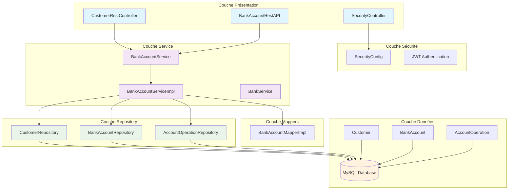
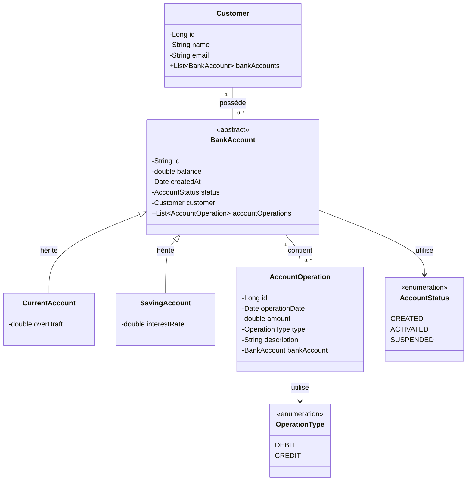

# E-Banking Backend - Application de Banque Numérique

Ce projet est une application backend complète de banque électronique développée avec Spring Boot. Il fournit une base solide pour comprendre les concepts fondamentaux du développement backend et peut servir de référence pour les développeurs débutants.

## 📋 Table des Matières

- [À propos du projet](#-à-propos-du-projet)
- [Architecture du système](#-architecture-du-système)
- [Diagramme de classes](#-diagramme-de-classes)
- [Technologies utilisées](#-technologies-utilisées)
- [Structure du projet](#-structure-du-projet)
- [Installation et configuration](#-installation-et-configuration)
- [Utilisation](#-utilisation)
- [API Endpoints](#-api-endpoints)
- [Sécurité](#-sécurité)
- [Guide de développement](#-guide-de-développement)

## 🏦 À propos du projet

Cette application e-banking permet de gérer :

- **Gestion des clients** : Création, modification, suppression et recherche de clients
- **Gestion des comptes bancaires** : Comptes courants et comptes épargne
- **Opérations bancaires** : Débits, crédits et virements
- **Historique des transactions** : Consultation paginée des opérations
- **Authentification JWT** : Sécurisation des endpoints avec tokens JWT

### Fonctionnalités principales

- ✅ CRUD complet pour les clients
- ✅ Gestion de deux types de comptes (Courant/Épargne)
- ✅ Opérations bancaires sécurisées (débit, crédit, virement)
- ✅ Historique des transactions avec pagination
- ✅ Authentification et autorisation JWT
- ✅ Documentation API avec SpringDoc OpenAPI
- ✅ Architecture en couches (Controller → Service → Repository)

## 🏗️ Architecture du système



## 📊 Diagramme de classes



## 🛠 Technologies utilisées

| Technologie                | Version | Description                                                   |
| -------------------------- | ------- | ------------------------------------------------------------- |
| **Spring Boot**            | 3.3.0   | Framework principal pour le développement d'applications Java |
| **Spring Web**             | -       | Pour créer des APIs RESTful                                   |
| **Spring Data JPA**        | -       | Pour l'interaction avec la base de données via JPA/Hibernate  |
| **Spring Security OAuth2** | -       | Pour l'authentification et l'autorisation JWT                 |
| **MySQL Connector**        | 8.3.0   | Connecteur pour base de données MySQL                         |
| **Lombok**                 | 1.18.32 | Pour réduire le code boilerplate                              |
| **SpringDoc OpenAPI**      | 2.5.0   | Pour la documentation automatique de l'API                    |
| **Maven**                  | -       | Gestionnaire de dépendances                                   |
| **Java**                   | 21      | Langage de programmation                                      |

## 📁 Structure du projet

```
ebanking-backend/
├── src/main/java/ma/enset/
│   ├── EbankingBackendApplication.java    # Point d'entrée de l'application
│   ├── dto/                              # Data Transfer Objects
│   │   ├── CustomerDTO.java
│   │   ├── BankAccountDTO.java
│   │   ├── CurrentBankAccountDTO.java
│   │   ├── SavingBankAccountDTO.java
│   │   ├── AccountOperationDTO.java
│   │   ├── AccountHistoryDTO.java
│   │   ├── CreditDTO.java
│   │   ├── DebitDTO.java
│   │   └── TransferRequestDTO.java
│   ├── entities/                         # Entités JPA (modèle de données)
│   │   ├── Customer.java
│   │   ├── BankAccount.java
│   │   ├── CurrentAccount.java
│   │   ├── SavingAccount.java
│   │   └── AccountOperation.java
│   ├── enums/                            # Énumérations
│   │   ├── AccountStatus.java
│   │   └── OperationType.java
│   ├── exceptions/                       # Exceptions personnalisées
│   │   ├── CustomerNotFoundException.java
│   │   ├── BankAccountNotFoundException.java
│   │   └── BalanceNotSufficientException.java
│   ├── repositories/                     # Couche d'accès aux données
│   │   ├── CustomerRepository.java
│   │   ├── BankAccountRepository.java
│   │   └── AccountOperationRepository.java
│   ├── service/                          # Logique métier
│   │   ├── BankAccountService.java
│   │   ├── BankAccountServiceImpl.java
│   │   └── BankService.java
│   ├── web/                              # Contrôleurs REST
│   │   ├── CustomerRestController.java
│   │   └── BankAccountRestAPI.java
│   ├── security/                         # Configuration de sécurité
│   │   ├── SecurityConfig.java
│   │   └── SecurityController.java
│   └── mappers/                          # Mappers pour conversion Entity ↔ DTO
│       └── BankAccountMapperImpl.java
├── src/main/resources/
│   └── application.properties            # Configuration de l'application
├── class-diagram.mermaid                 # Diagramme de classes Mermaid
└── pom.xml                              # Configuration Maven
```

## ⚙️ Installation et configuration

### Prérequis

- **Java 21** ou version supérieure
- **Maven 3.6+**
- **MySQL 8.0+**
- **IDE** (IntelliJ IDEA, Eclipse, VS Code)

### Étapes d'installation

1. **Cloner le projet**

   ```bash
   git clone [url-du-projet]
   cd ebanking-backend
   ```

2. **Configurer la base de données**

   Créer une base de données MySQL :

   ```sql
   CREATE DATABASE `digital-banking`;
   ```

3. **Configuration de l'application**

   Modifier `src/main/resources/application.properties` :

   ```properties
   # Configuration de l'application
   spring.application.name=digital-banking
   server.port=8085

   # Configuration de la base de données
   spring.datasource.url=jdbc:mysql://localhost:3306/digital-banking?createDatabaseIfNotExist=true
   spring.datasource.username=root
   spring.datasource.password=
   spring.datasource.driver-class-name=com.mysql.cj.jdbc.Driver

   # Configuration JPA/Hibernate
   spring.jpa.hibernate.ddl-auto=update
   spring.jpa.properties.hibernate.dialect=org.hibernate.dialect.MySQL8Dialect
   spring.jpa.show-sql=true

   # Configuration JWT
   jwt.secret=9faa372517ac1d389764739hfs9397365na5783azc083729faa372517ac1d389
   ```

4. **Lancer l'application**

   ```bash
   mvn spring-boot:run
   ```

   Ou depuis votre IDE : exécuter `EbankingBackendApplication.java`

## 🚀 Utilisation

### Accès à l'application

- **URL de base** : `http://localhost:8085`
- **Documentation OpenAPI** : `http://localhost:8085/swagger-ui.html`

### Authentification

L'application utilise JWT pour la sécurité. Utilisateurs par défaut :

| Utilisateur | Mot de passe | Rôles       |
| ----------- | ------------ | ----------- |
| `user1`     | `12345`      | USER        |
| `admin`     | `12345`      | USER, ADMIN |

**Connexion** :

```bash
curl -X POST http://localhost:8085/auth/login \
  -d "username=admin&password=12345"
```

## 📚 API Endpoints

### 🔐 Authentification

```
POST /auth/login          # Connexion et obtention du token JWT
GET  /auth/profile        # Profil de l'utilisateur connecté
```

### 👥 Gestion des clients

```
GET    /customers                    # Liste tous les clients
GET    /customers/{id}               # Récupère un client par ID
GET    /customers/search?keyword=    # Recherche de clients
POST   /customers                   # Crée un nouveau client
PUT    /customers/{id}              # Met à jour un client
DELETE /customers/{id}              # Supprime un client (retourne 200 OK ou 404/500)
```

### 🏦 Gestion des comptes

```
GET /accounts                           # Liste tous les comptes
GET /accounts/{accountId}               # Récupère un compte par ID
GET /accounts/{accountId}/operations    # Historique des opérations
GET /accounts/{accountId}/pageOperations # Historique paginé
```

### Exemple de requêtes

**Créer un client** :

```json
POST /customers
{
  "name": "Jean Dupont",
  "email": "jean.dupont@email.com"
}
```

**Réponse** :

```json
{
  "id": 1,
  "name": "Jean Dupont",
  "email": "jean.dupont@email.com"
}
```

**Supprimer un client** :

```bash
DELETE /customers/1
```

**Réponse (succès)** :

```
HTTP 200 OK
"Customer deleted successfully"
```

**Réponse (erreur - client non trouvé)** :

```
HTTP 404 Not Found
```

**Réponse (erreur - client a des comptes actifs)** :

```
HTTP 500 Internal Server Error
"Error deleting customer"
```

## 🔒 Sécurité

### Configuration JWT

- **Algorithme** : HS512
- **Durée de validité** : 10 minutes
- **Header** : `Authorization: Bearer <token>`

### Accès aux endpoints

- `/auth/login` : Accès libre
- Tous les autres endpoints : Authentification requise

## 📖 Guide de développement

### Architecture en couches

1. **Couche Présentation (Web)** : `@RestController`

   - Gère les requêtes HTTP
   - Validation des données d'entrée
   - Formatage des réponses

2. **Couche Service** : `@Service`

   - Logique métier
   - Orchestration des appels
   - Gestion des transactions

3. **Couche Accès aux données** : `@Repository`
   - Interaction avec la base de données
   - Requêtes JPA/SQL

### Annotations importantes

#### Entités JPA

```java
@Entity                    // Marque la classe comme entité JPA
@Id                       // Clé primaire
@GeneratedValue           // Génération automatique de l'ID
@OneToMany / @ManyToOne   // Relations entre entités
@Enumerated               // Pour les énumérations
```

#### Spring Boot

```java
@SpringBootApplication    // Point d'entrée de l'application
@RestController          // Contrôleur REST
@Service                 // Service (logique métier)
@Repository              // Repository (accès données)
@Autowired               // Injection de dépendance
@Transactional           // Gestion des transactions
```

#### Mapping des requêtes

```java
@GetMapping              // GET HTTP
@PostMapping             // POST HTTP
@PutMapping              // PUT HTTP
@DeleteMapping           // DELETE HTTP
@PathVariable            // Variable dans l'URL
@RequestParam            // Paramètre de requête
@RequestBody             // Corps de la requête
```

### Initialisation des données

L'application contient un `CommandLineRunner` qui :

- Crée des clients de test
- Génère des comptes (courant et épargne)
- Effectue des transactions d'exemple
- Facilite les tests et la démonstration

### Bonnes pratiques implémentées

- **Séparation des responsabilités** avec l'architecture en couches
- **DTOs** pour découpler l'API des entités internes
- **Gestion d'erreurs** avec des exceptions personnalisées
- **Sécurité** avec Spring Security et JWT
- **Documentation** automatique avec Swagger
- **Code propre** avec Lombok pour réduire le boilerplate

## 🤝 Contribution

Pour contribuer au projet :

1. Fork le projet
2. Créer une branche feature (`git checkout -b feature/nouvelle-fonctionnalite`)
3. Commit vos changements (`git commit -m 'Ajout nouvelle fonctionnalité'`)
4. Push vers la branche (`git push origin feature/nouvelle-fonctionnalite`)
5. Ouvrir une Pull Request

---

**Développé avec ❤️ en Spring Boot**

_Ce projet sert d'exemple éducatif pour apprendre le développement backend avec Spring Boot._
