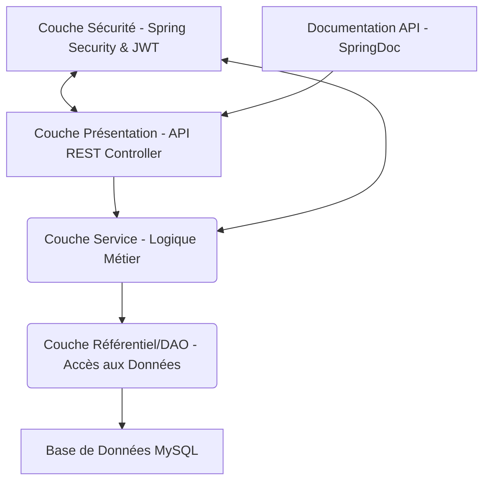
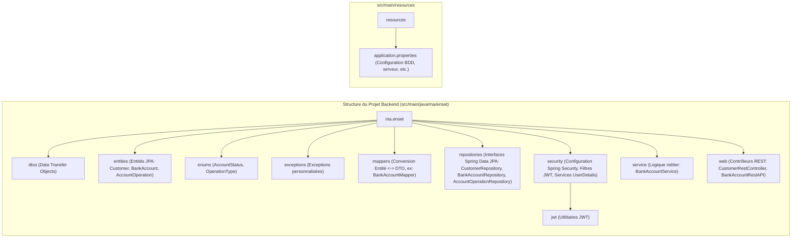

# Projet E-Banking: Solution Full-Stack Complète

## Vidéos de Présentation

[Vidéo de présentation](https://drive.google.com/file/d/1_-hYBY0M3dgx5dDnvAGOGkcRVTo7q1jG/view?usp=sharing](https://drive.google.com/file/d/1KQ0hUH4P5e9g4rFvqbDHU9TQqh54TSAg/view)

## Introduction

Ce document présente une application e-banking complète, une solution full-stack robuste combinant un backend développé avec Spring Boot et un frontend moderne construit avec Angular. L'objectif est d'offrir une plateforme bancaire numérique sécurisée, performante et conviviale. Nous détaillerons d'abord l'architecture et les fonctionnalités du backend, puis nous explorerons l'interface utilisateur et l'expérience proposée par le frontend. Ce projet a été conçu dans une perspective académique pour illustrer l'intégration de technologies et de méthodologies de développement actuelles.

## Partie 1: Backend Spring Boot

Le backend de l'application est développé en utilisant le framework Spring Boot, choisi pour sa robustesse, sa flexibilité et son écosystème riche pour la création d'applications Java d'entreprise.

### 1. Architecture du Backend

L'architecture du backend repose sur un modèle en couches classique, favorisant la modularité, la testabilité et la maintenabilité du code :

- **Couche Présentation (Presentation Layer)** : Constituée de contrôleurs REST (`@RestController`). Elle est responsable de la gestion des requêtes HTTP entrantes, de la validation initiale des données et de la transformation des objets métier en réponses HTTP (souvent au format JSON). Elle s'appuie sur Spring MVC.
- **Couche Service (Service Layer)** : Contient la logique métier (business logic) principale de l'application. Elle orchestre les opérations, implémente les cas d'usage, gère les transactions et interagit avec la couche d'accès aux données. Les services sont typiquement des beans Spring (`@Service`).
- **Couche Référentiel/DAO (Repository/Data Access Object Layer)** : Responsable de l'interaction avec la base de données. Elle utilise Spring Data JPA pour abstraire et simplifier les opérations CRUD (Create, Read, Update, Delete) sur les entités persistantes. Les interfaces de cette couche étendent souvent `JpaRepository`.
- **Couche Sécurité (Security Layer)** : Intégrée transversalement grâce à Spring Security. Elle gère l'authentification (vérification de l'identité) et l'autorisation (contrôle des accès aux ressources) à l'aide de JSON Web Tokens (JWT).
- **Base de Données (Database)** : MySQL est utilisé comme système de gestion de base de données relationnelle pour la persistance des données.
- **Documentation API** : SpringDoc OpenAPI (successeur de Swagger) est utilisé pour générer automatiquement une documentation interactive de l'API REST, facilitant sa compréhension et son utilisation par les développeurs frontend ou d'autres consommateurs.

### 2. Technologies Utilisées (Backend)

Le socle technologique du backend est le suivant :

- **Java**: Langage de programmation principal.
- **Spring Boot 3.3.0** : Framework principal pour le développement rapide d'applications Java autonomes et robustes.
- **Spring MVC**: Pour la création des API RESTful.
- **Spring Security**: Pour la gestion de la sécurité, notamment l'authentification basée sur JWT et la protection des endpoints.
- **Spring Data JPA**: Pour la persistance des données et l'interaction simplifiée avec la base de données relationnelle.
- **Hibernate**: Implémentation JPA par défaut utilisée par Spring Data JPA.
- **MySQL**: Système de gestion de base de données relationnelle.
- **JSON Web Tokens (JWT)**: Pour la création de tokens d'accès sécurisés et stateless.
- **SpringDoc OpenAPI (Swagger)** : Pour la génération automatique de la documentation API.
- **Lombok**: Bibliothèque utilitaire pour réduire le code répétitif (boilerplate) via des annotations (ex: `@Data`, `@Getter`, `@Setter`).
- **Maven**: Outil de gestion de projet, de dépendances et de build.

### 3. Structure du Projet (Backend)

Le projet backend est organisé de manière conventionnelle pour les applications Spring Boot, principalement sous `src/main/java/ma/enset` :

- `config`: Contient des classes de configuration diverses pour l'application.
- `dtos`: Objets de Transfert de Données, utilisés pour structurer les données échangées via l'API REST, découplant ainsi l'API des entités de la base de données.
- `entities`: Classes représentant les entités persistantes (tables de la base de données) gérées par JPA (ex: `Customer`, `BankAccount`, `AccountOperation`).
- `enums`: Énumérations utilisées dans le modèle de données (ex: `AccountStatus`, `OperationType`).
- `exceptions`: Classes d'exceptions personnalisées pour une gestion d'erreurs métier spécifique et claire.
- `mappers`: Interfaces (souvent utilisant MapStruct ou implémentées manuellement) pour la conversion entre les Entités JPA et les DTOs.
- `repositories`: Interfaces étendant `JpaRepository` (ou d'autres interfaces Spring Data) pour l'accès aux données. Spring Data génère automatiquement les implémentations.
- `security`: Regroupe toute la configuration et la logique liées à Spring Security, y compris la configuration des filtres JWT, le service de chargement des détails de l'utilisateur (`UserDetailsService`), et les utilitaires pour la génération et la validation des JWT.
- `service`: Contient les classes de service (`@Service`) qui implémentent la logique métier de l'application.
- `web`: Abrite les contrôleurs REST (`@RestController`) qui exposent les points d'accès (endpoints) de l'API.
- `resources/application.properties`: Fichier de configuration principal de Spring Boot (configuration de la base de données, du port du serveur, des propriétés JWT, etc.).

### 4. Fonctionnalités Clés du Backend

L'API backend offre un ensemble complet de services bancaires numérisés :

- **Gestion des Clients (Customer Management)** :
  - Opérations CRUD (Créer, Lire, Mettre à jour, Supprimer) complètes pour les clients de la banque.
  - Recherche de clients par mots-clés.
  - Endpoints principaux : `GET /customers`, `GET /customers/{id}`, `POST /customers`, `PUT /customers/{id}`, `DELETE /customers/{id}`, `GET /customers/search`.
- **Gestion des Comptes Bancaires (Account Management)** :
  - Prise en charge de différents types de comptes (Compte Courant: `CurrentAccount`, Compte d'Épargne: `SavingAccount`).
  - Consultation des détails d'un compte, liste de tous les comptes, comptes d'un client spécifique.
  - Endpoints : `GET /accounts/{accountId}`, `GET /accounts`, `GET /customer-accounts/{customerId}`, `POST /accounts` (la création de compte est typiquement liée à un client existant).
- **Opérations Bancaires (Banking Operations)** :
  - **Crédit (Credit)** : Dépôt de fonds sur un compte. Endpoint : `POST /accounts/credit`.
  - **Débit (Debit)** : Retrait de fonds d'un compte. Endpoint : `POST /accounts/debit`.
  - **Virement (Transfer)** : Transfert de fonds entre deux comptes. Endpoint : `POST /accounts/transfer`.
  - **Historique des opérations** : Consultation de l'historique des transactions pour un compte donné, avec pagination. Endpoints : `GET /accounts/{accountId}/operations`, `GET /accounts/{accountId}/pageOperations`.
- **Pagination et Recherche** : La plupart des listes (clients, comptes, opérations) supportent la pagination pour une gestion efficace de grands volumes de données, ainsi que des fonctionnalités de recherche.

### 5. Sécurité et Authentification

La sécurité de l'application est un aspect crucial, géré par Spring Security et JWT :

- **Flux d'Authentification** :
  1.  L'utilisateur envoie ses identifiants (ex: nom d'utilisateur et mot de passe) à un endpoint d'authentification dédié (ex: `/auth/login`).
  2.  Le backend valide ces identifiants.
  3.  En cas de succès, un JWT (contenant des informations sur l'utilisateur et ses droits, ainsi qu'une date d'expiration) est généré et retourné au client.
- **Protection des Endpoints** : Pour accéder aux ressources protégées, le client doit inclure ce JWT dans l'en-tête `Authorization` de chaque requête HTTP, sous la forme `Bearer <token>`.
- **Filtre JWT** : Un filtre personnalisé (`JwtAuthorizationFilter` ou similaire) intercepte chaque requête, valide le JWT et, si valide, configure le contexte de sécurité de Spring (`SecurityContextHolder`) avec les informations de l'utilisateur authentifié.
- **Configuration de la Sécurité** : La classe de configuration principale (ex: `SecurityConfig`) définit les règles d'accès (quels endpoints sont publics, lesquels nécessitent une authentification, quels rôles sont requis), configure le gestionnaire d'authentification, et enregistre les filtres de sécurité.
- **Rôles et Permissions** : Le système est conçu pour gérer différents rôles (ex: `ADMIN`, `USER`). Des utilisateurs par défaut (`admin` et `user1`) sont créés avec des rôles distincts pour illustrer ce concept.

### 6. Initialisation des Données

Pour faciliter le développement, les tests et la démonstration, une initialisation de données de démonstration est effectuée au démarrage de l'application. Ceci est généralement réalisé à l'aide d'un `CommandLineRunner` ou d'un bean `@PostConstruct` dans une classe de service ou de configuration.
Cette initialisation comprend :

- La création de plusieurs clients exemples (ex: Hassan, Imane, Mohamed).
- L'ouverture de comptes bancaires (courants et épargne) pour ces clients, avec des soldes initiaux et des attributs spécifiques (ex: taux d'intérêt pour les comptes d'épargne, découvert autorisé pour les comptes courants).
- La génération d'un ensemble d'opérations bancaires aléatoires (crédits, débits) pour chaque compte afin de peupler l'historique des transactions et de rendre l'application plus réaliste dès le démarrage.

## Partie 2: Frontend Angular

Le frontend est une Single Page Application (SPA) développée avec Angular (version 18 mentionnée dans le script, à vérifier avec `package.json`), offrant une interface utilisateur dynamique et réactive pour interagir avec les services du backend.

### 1. Vue d'ensemble du Frontend

L'interface utilisateur est conçue pour être moderne et intuitive :

- **Conception sur mesure** : Le style n'est pas basé sur des bibliothèques UI externes majeures comme Bootstrap, ce qui suggère un système de design personnalisé.
- **Thèmes** : Propose un thème sombre (dark mode) par défaut, avec une option pour basculer vers un thème clair (light mode), améliorant l'accessibilité et la préférence utilisateur.
- **Responsive Design** : L'application est conçue pour s'adapter à différentes tailles d'écran (ordinateurs de bureau, tablettes, smartphones).

### 2. Technologies Utilisées (Frontend)

Les principales technologies et bibliothèques utilisées pour le frontend sont :

- **Angular (v18)**: Framework TypeScript développé par Google pour la construction d'applications web.
- **TypeScript**: Sur-ensemble de JavaScript typé, améliorant la robustesse et la maintenabilité du code.
- **HTML5 & CSS3 (ou SCSS/SASS)**: Pour la structure et la présentation des pages.
- **RxJS**: Bibliothèque pour la programmation réactive, largement utilisée dans Angular pour gérer les opérations asynchrones et les flux de données.
- **Angular Router**: Pour la navigation côté client et la gestion des vues.
- **Angular HttpClient**: Pour la communication avec l'API REST du backend.
- **Angular Forms**: Pour la création et la validation de formulaires (Reactive Forms ou Template-driven Forms).
- **Node.js & npm**: Pour l'environnement de développement, la gestion des dépendances et le build de l'application.

### 3. Structure du Projet (Frontend)

Le projet frontend est structuré de manière modulaire, typique des applications Angular, principalement dans le dossier `ebanking-frontend/src/app` :

```mermaid
graph LR
    subgraph "Structure du Projet Frontend (ebanking-frontend/src/app)"
        direction TB
        app_root["app (Dossier Racine)"]
        app_root --> app_component["app.component (Composant Racine)"]
        app_root --> app_module["app.module.ts (Module Principal ou config standalone)"]
        app_root --> app_routes["app.routes.ts (Configuration du Routage)"]
        app_root --> core_features["Fonctionnalités Principales"]
        core_features --> accounts["accounts/ (AccountsComponent, etc.)"]
        core_features --> customer_account["customer-account/ (CustomerAccountComponent)"]
        core_features --> customers["customers/ (CustomersComponent, etc.)"]
        core_features --> dashboard["dashboard/ (DashboardComponent)"]
        core_features --> login["login/ (LoginComponent)"]
        core_features --> navbar["navbar/ (NavbarComponent)"]
        core_features --> new_customer["new-customer/ (NewCustomerComponent)"]
        core_features --> new_operation["new-operation/ (NewOperationComponent)"]
        app_root --> shared_elements["Éléments Partagés"]
        shared_elements --> guards["guards/ (AuthGuard, AdminGuard)"]
        shared_elements --> interceptors["interceptors/ (AppHttpInterceptor, AuthInterceptor)"]
        shared_elements --> model["model/ (Interfaces TypeScript: account.model.ts, customer.model.ts)"]
        shared_elements --> services["services/ (AccountService, AuthService, CustomerService)"]
        app_root --> assets["assets/ (Images, polices, etc.)"]
        app_root --> environments["environments/ (environment.ts, environment.prod.ts)"]
    end
```

- `app.component.{ts,html,css}`: Composant racine de l'application.
- `app.module.ts` (ou `app.config.ts` pour les applications standalone): Module principal qui déclare les composants, services, et importe d'autres modules.
- `app.routes.ts`: Définit les routes de l'application et les composants associés.
- **Dossiers de fonctionnalités** (ex: `accounts`, `customers`, `login`, `dashboard`): Chaque dossier regroupe les composants, templates, styles et services spécifiques à une fonctionnalité métier.
- `guards`: Contient les gardes de route (ex: `AuthGuard` pour vérifier si un utilisateur est authentifié avant d'accéder à une route, `AdminGuard` pour les routes réservées aux administrateurs).
- `interceptors`: Intercepteurs HTTP (ex: `AuthInterceptor` pour ajouter automatiquement le token JWT aux requêtes sortantes, `AppHttpInterceptor` pour la gestion globale des erreurs HTTP).
- `model`: Interfaces TypeScript définissant la structure des objets de données échangés avec le backend (ex: `Customer`, `BankAccount`, `AccountOperation`).
- `services`: Services Angular (`@Injectable`) responsables de la communication avec l'API backend, de la gestion de l'état partagé et de la logique métier côté client.
- `assets`: Pour les fichiers statiques (images, icônes, etc.).
- `environments`: Fichiers de configuration spécifiques à l'environnement (développement, production).

### 4. Authentification et Navigation

- **Page de Connexion (`login/login.component.ts`)**: L'application démarre typiquement par une page de connexion où l'utilisateur doit s'identifier. Le `AuthService` gère la logique d'authentification, stocke le JWT reçu (souvent dans `localStorage` ou `sessionStorage`) et les informations de l'utilisateur.
- **Barre de Navigation (`navbar/navbar.component.ts`)**: Une fois l'utilisateur connecté, une barre de navigation s'affiche. Elle est dynamique et adapte les options visibles (liens de navigation, actions) en fonction du rôle de l'utilisateur (extrait du JWT) et de son état d'authentification. Elle peut inclure une fonctionnalité de recherche globale et un bouton de déconnexion.
- **Gardes de Route (`guards/`)**: `AuthGuard` protège les routes qui nécessitent une authentification. `AdminGuard` (si implémenté) protège les routes spécifiques aux administrateurs.

### 5. Tableau de Bord et Statistiques (`dashboard/dashboard.component.ts`)

Le tableau de bord est la page d'accueil après connexion, offrant une vue d'ensemble :

- **Cartes de Statistiques Clés**: Affichage d'indicateurs importants (ex: nombre total de clients, solde global des comptes).
- **Graphiques Interactifs**: Visualisation de données (ex: répartition des types de comptes, évolution des opérations) en utilisant des bibliothèques comme Chart.js ou ngx-charts.
- **Actions Rapides**: Boutons pour accéder rapidement aux fonctionnalités courantes.
- **Vue Conditionnelle**: Le contenu du tableau de bord peut varier en fonction du rôle de l'utilisateur (plus d'informations ou d'options de gestion pour un administrateur).

### 6. Gestion des Clients (`customers/customers.component.ts`, `new-customer/new-customer.component.ts`)

Cette section permet la gestion du portefeuille clients :

- **Liste des Clients (`customers`)**: Affichage paginé des clients, avec des fonctionnalités de recherche (par nom, email, etc.) et de tri.
- **Ajout de Nouveau Client (`new-customer`)**: Formulaire (Reactive Form) pour enregistrer un nouveau client, avec validation des champs en temps réel et feedback à l'utilisateur. Cette fonctionnalité est généralement réservée aux administrateurs.
- **Modification et Suppression de Client**: Fonctionnalités pour mettre à jour les informations d'un client existant ou le supprimer (souvent avec confirmation).
- **Consultation des Comptes d'un Client (`customer-account/customer-account.component.ts`)**: Possibilité de voir les comptes bancaires associés à un client sélectionné.

### 7. Gestion des Comptes et Opérations (`accounts/accounts.component.ts`, `new-operation/new-operation.component.ts`)

Cette partie de l'application se concentre sur les comptes bancaires et leurs transactions :

- **Recherche et Consultation de Comptes (`accounts`)**: Permet de rechercher un compte par son identifiant et d'afficher ses détails (solde, type, client propriétaire, historique des opérations).
- **Historique des Opérations**: Affichage paginé des transactions (crédits, débits, virements) pour un compte sélectionné, avec des informations claires (date, type, montant, description). Les opérations peuvent être codées par couleur pour une meilleure lisibilité.
- **Nouvelles Opérations (`new-operation`)**: Interface pour initier des opérations bancaires :
  - **Crédit/Débit**: Formulaire pour déposer ou retirer des fonds d'un compte.
  - **Virement**: Formulaire pour transférer des fonds entre deux comptes (le compte source de l'utilisateur et un compte destinataire).
  - Validation des montants, des identifiants de compte, et feedback en temps réel.

### 8. Fonctionnalités Avancées et Expérience Utilisateur

L'application vise une expérience utilisateur soignée grâce à :

- **Recherche Globale**: Fonctionnalité de recherche (dans la navbar) permettant de trouver rapidement des clients ou des comptes.
- **Sélecteur de Thème**: Bouton permettant à l'utilisateur de choisir entre le thème sombre et le thème clair.
- **Notifications Toast**: Messages non bloquants (pop-ups) pour informer l'utilisateur du succès ou de l'échec des opérations, ou pour d'autres alertes contextuelles.
- **Gestion des Erreurs**: Interception des erreurs HTTP (via `HttpInterceptor`) et affichage de messages d'erreur clairs à l'utilisateur.
- **Indicateurs de Chargement**: Feedback visuel (spinners, barres de progression) pendant les appels API ou les opérations longues.
- **Progressive Web App (PWA) (Potentiel)**: Si configurée, l'application pourrait offrir des fonctionnalités PWA (installation sur l'appareil, accès hors-ligne limité).

## Points Techniques Saillants et Bonnes Pratiques

Ce projet s'efforce de mettre en œuvre des pratiques de développement reconnues :

**Backend (Spring Boot)** :

- **Principe de Responsabilité Unique (SRP)**: Chaque classe et méthode a une responsabilité bien définie.
- **Injection de Dépendances (DI)**: Largement utilisée par Spring pour gérer les composants et leurs interdépendances, favorisant un couplage faible.
- **Gestion Centralisée des Exceptions**: Utilisation de `@ControllerAdvice` et `@ExceptionHandler` pour une gestion cohérente des erreurs à travers l'API.
- **Validation des Données**: Utilisation de Bean Validation (annotations JSR 380) sur les DTOs pour valider les données entrantes.
- **Tests Unitaires et d'Intégration**: (À développer) Utilisation de JUnit et Mockito pour les tests unitaires, et Spring Boot Test pour les tests d'intégration.

**Frontend (Angular)** :

- **Architecture Basée sur les Composants**: Application structurée en composants réutilisables et bien définis.
- **Programmation Réactive avec RxJS**: Gestion efficace des flux de données asynchrones et des événements utilisateur.
- **Services pour la Logique Partagée**: Centralisation de la logique d'accès aux données et de la logique métier partagée dans les services injectables.
- **Lazy Loading des Modules**: Optimisation des performances en ne chargeant les modules de fonctionnalités que lorsqu'ils sont nécessaires.
- **Gestion d'État (State Management)**: Pour les applications plus complexes, des solutions comme NgRx ou Akita pourraient être envisagées, bien que pour ce projet, les services Angular puissent suffire.
- **Formulaires Réactifs (Reactive Forms)**: Pour une gestion robuste et testable des formulaires et de leur validation.
- **Typage Fort avec TypeScript**: Amélioration de la qualité du code et réduction des erreurs au moment de l'exécution.

## Conclusion

L'application e-banking présentée est une illustration concrète d'une solution full-stack, intégrant un backend Spring Boot sécurisé et performant avec un frontend Angular moderne et réactif. Elle met en œuvre des concepts architecturaux et des patrons de conception pertinents pour le développement d'applications web d'entreprise. Ce projet sert de base solide pour explorer des fonctionnalités plus avancées et des optimisations ultérieures, tout en constituant un portfolio technique démonstratif.

Le code source complet est disponible dans ce dépôt, et cette documentation vise à en faciliter la compréhension, l'exécution et l'éventuelle extension.
