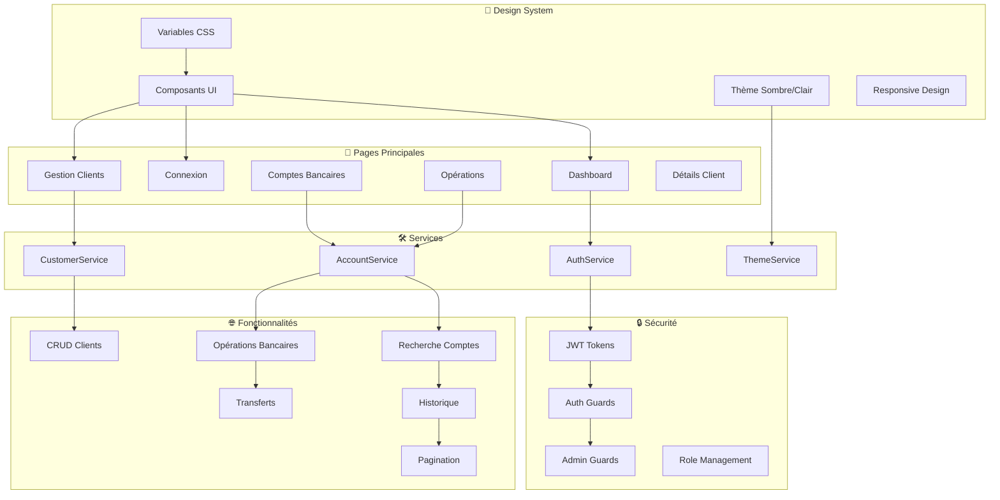
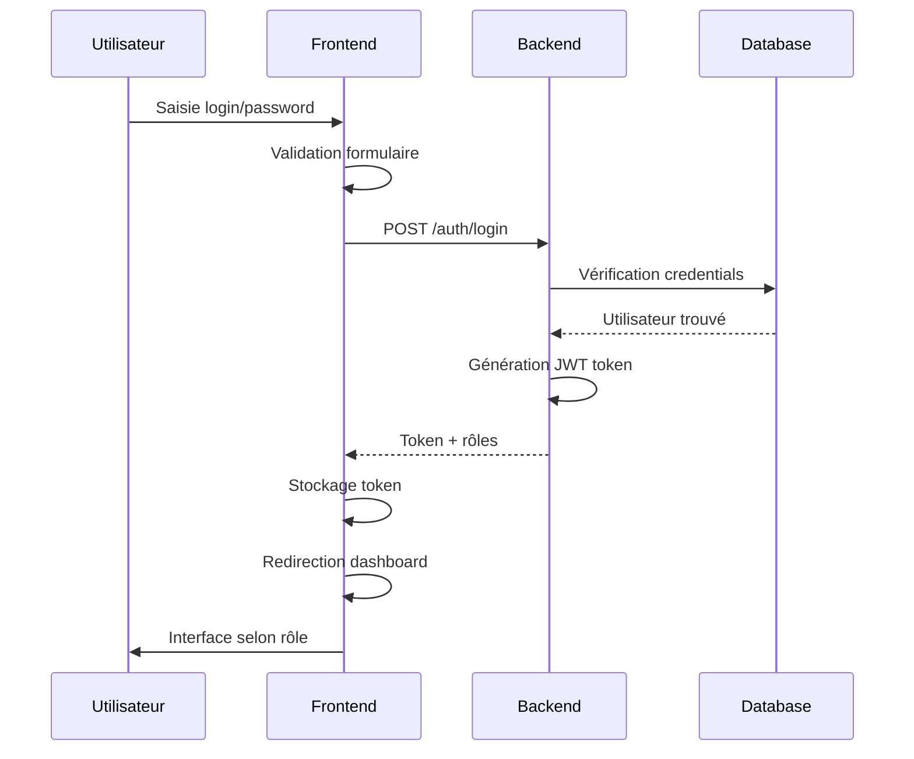
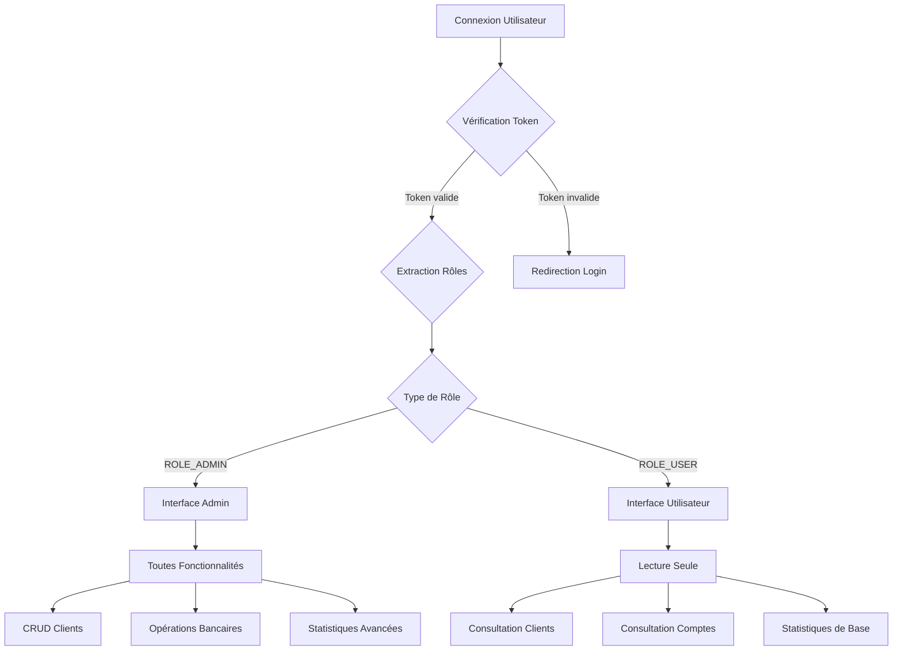
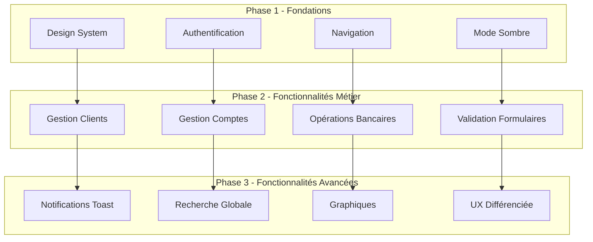
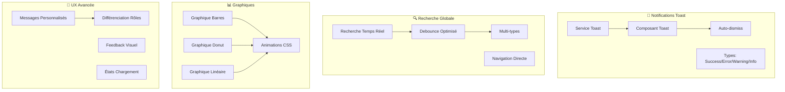

# 🏦 Banque Numérique - Frontend

Une application frontend moderne pour la gestion bancaire, développée avec Angular 18 et un design system personnalisé.


## 📋 Table des Matières

- [🎯 Aperçu](#-aperçu)
- [✨ Fonctionnalités](#-fonctionnalités)
- [🏗️ Architecture](#️-architecture)
- [🚀 Installation](#-installation)
- [👥 Comptes de Test](#-comptes-de-test)
- [📱 Captures d'Écran](#-captures-décran)
- [🎨 Design System](#-design-system)
- [🔐 Sécurité](#-sécurité)
- [📊 Diagrammes](#-diagrammes)
- [🛠️ Développement](#️-développement)
- [📝 API](#-api)
- [🤝 Contribution](#-contribution)

## 🎯 Aperçu

**Banque Numérique** est une application web moderne de gestion bancaire qui offre une interface intuitive pour la gestion des clients, comptes bancaires et opérations financières. L'application propose deux niveaux d'accès : utilisateur en lecture seule et administrateur avec permissions complètes.

### 🌟 Points Forts

- **Design moderne** sans Bootstrap, avec un système de design personnalisé
- **Mode sombre** par défaut avec possibilité de basculer
- **Interface entièrement en français**
- **Responsive design** optimisé pour mobile et desktop
- **Notifications toast** en temps réel
- **Recherche globale** intelligente
- **Graphiques et statistiques** avancées
- **Gestion des rôles** utilisateur/administrateur

## ✨ Fonctionnalités

### 👤 Gestion des Utilisateurs

#### **Utilisateur Standard**

- 👁️ **Consultation** des clients et comptes
- 📊 **Visualisation** des statistiques de base
- 🔍 **Recherche** dans les données
- ❌ **Pas d'opérations** de modification

#### **Administrateur**

- ✏️ **Gestion complète** (CRUD) des clients
- 💰 **Opérations bancaires** (crédit, débit, transfert)
- 📈 **Statistiques avancées** avec graphiques
- 🔧 **Accès** à toutes les fonctionnalités

### 🏦 Fonctionnalités Bancaires

#### **Gestion des Clients**

- ✅ Liste des clients avec recherche
- ✅ Ajout de nouveaux clients (admin)
- ✅ Suppression de clients (admin)
- ✅ Détails client avec comptes associés
- ✅ Validation complète des formulaires

#### **Gestion des Comptes**

- ✅ Recherche de comptes par ID
- ✅ Affichage des détails et solde
- ✅ Historique des opérations avec pagination
- ✅ Types d'opérations avec badges colorés
- ✅ Formatage des montants en euros

#### **Opérations Bancaires**

- ✅ Interface à onglets : Opérations simples et Transferts
- ✅ Crédit et Débit avec validation
- ✅ Transferts entre comptes automatisés
- ✅ Messages de confirmation et gestion d'erreurs
- ✅ États de chargement pendant les opérations

### 🔍 Fonctionnalités Avancées

#### **Recherche Globale**

- ✅ Recherche en temps réel avec debounce
- ✅ Recherche multi-types (clients, comptes)
- ✅ Suggestions intelligentes
- ✅ Navigation directe vers les résultats

#### **Notifications Toast**

- ✅ 4 types : Success, Error, Warning, Info
- ✅ Auto-dismiss configurable
- ✅ Animations fluides
- ✅ Positionnement responsive

#### **Graphiques et Statistiques**

- ✅ Graphiques en barres, donut et linéaires
- ✅ Animations CSS pures
- ✅ Données en temps réel
- ✅ Formatage des valeurs (nombre, devise, pourcentage)

## 🏗️ Architecture

### Structure du Projet

```
ebanking-frontend/
├── src/
│   ├── app/
│   │   ├── shared/
│   │   │   ├── components/          # Composants réutilisables
│   │   │   │   ├── button/
│   │   │   │   ├── card/
│   │   │   │   ├── input/
│   │   │   │   ├── alert/
│   │   │   │   ├── toast/
│   │   │   │   ├── global-search/
│   │   │   │   └── stats-chart/
│   │   │   └── services/            # Services partagés
│   │   │       ├── theme.service.ts
│   │   │       └── toast.service.ts
│   │   ├── services/                # Services métier
│   │   │   ├── auth.service.ts
│   │   │   ├── customer.service.ts
│   │   │   └── account.service.ts
│   │   ├── guards/                  # Guards de sécurité
│   │   │   ├── auth.guard.ts
│   │   │   └── admin.guard.ts
│   │   ├── interceptors/            # Intercepteurs HTTP
│   │   │   ├── auth.interceptor.ts
│   │   │   └── app-http.interceptor.ts
│   │   ├── model/                   # Modèles de données
│   │   ├── dashboard/               # Page tableau de bord
│   │   ├── customers/               # Gestion des clients
│   │   ├── accounts/                # Gestion des comptes
│   │   ├── new-operation/           # Opérations bancaires
│   │   ├── new-customer/            # Ajout de clients
│   │   ├── customer-account/        # Détails client
│   │   ├── login/                   # Authentification
│   │   └── navbar/                  # Navigation
│   ├── styles.css                   # Styles globaux et design system
│   └── index.html
├── angular.json
├── package.json
└── README.md
```

### Technologies Utilisées

- **Angular 18.2.12** - Framework frontend
- **TypeScript 5.0+** - Langage de programmation
- **RxJS** - Programmation réactive
- **CSS pur** - Styles sans framework externe
- **JWT** - Authentification
- **SVG** - Icônes vectorielles

## 🚀 Installation

### Prérequis

- Node.js 18+
- npm 9+
- Angular CLI 18+

### Étapes d'Installation

1. **Cloner le repository**

   ```bash
   git clone <repository-url>
   cd ebanking-frontend
   ```

2. **Installer les dépendances**

   ```bash
   npm install
   ```

3. **Configurer l'environnement**

   ```bash
   # Copier le fichier d'environnement
   cp src/environments/environment.ts.example src/environments/environment.ts

   # Modifier l'URL de l'API backend
   # Par défaut: http://localhost:8085
   ```

4. **Démarrer l'application**

   ```bash
   npm start
   # ou
   ng serve
   ```

5. **Accéder à l'application**
   ```
   http://localhost:4200
   ```

### Build de Production

```bash
# Build optimisé pour la production
npm run build

# Build avec analyse des bundles
npm run build -- --stats-json
npx webpack-bundle-analyzer dist/ebanking-frontend/stats.json
```

## 👥 Comptes de Test

### Administrateur

- **Username:** `admin`
- **Password:** `12345`
- **Permissions:** Accès complet (CRUD clients, opérations bancaires, statistiques)

### Utilisateur Standard

- **Username:** `user1`
- **Password:** `12345`
- **Permissions:** Lecture seule (consultation clients, comptes, statistiques de base)

## 📱 Captures d'Écran

### Page de Connexion


_Interface de connexion moderne avec validation_

### Tableau de Bord - Mode Sombre


_Tableau de bord avec statistiques et graphiques en mode sombre_

### Tableau de Bord - Mode Clair


_Tableau de bord en mode clair_

### Gestion des Clients


_Liste des clients avec recherche et actions admin_

### Détails Client


_Page de détails d'un client avec ses comptes bancaires_

### Gestion des Comptes


_Recherche et consultation des comptes bancaires_

### Opérations Bancaires


_Interface d'opérations bancaires avec onglets_

### Ajout de Client


_Formulaire d'ajout de client avec validation_

### Recherche Globale


_Recherche globale intelligente avec suggestions_

### Notifications Toast


_Système de notifications toast en temps réel_

### Version Mobile


_Interface responsive optimisée pour mobile_

## 🎨 Design System

### Palette de Couleurs

#### Mode Sombre (Défaut)

```css
--primary-500: #3b82f6;
--bg-primary: #0f172a;
--bg-secondary: #1e293b;
--bg-card: #334155;
--text-primary: #f8fafc;
--text-secondary: #cbd5e1;
--border-primary: #475569;
```

#### Mode Clair

```css
--primary-500: #3b82f6;
--bg-primary: #ffffff;
--bg-secondary: #f8fafc;
--bg-card: #ffffff;
--text-primary: #0f172a;
--text-secondary: #475569;
--border-primary: #e2e8f0;
```

### Typographie

- **Police principale:** Inter (Google Fonts)
- **Tailles:** 12px à 48px avec échelle modulaire
- **Poids:** 300, 400, 500, 600, 700

### Espacement

```css
--spacing-xs: 0.25rem; /* 4px */
--spacing-sm: 0.5rem; /* 8px */
--spacing-md: 0.75rem; /* 12px */
--spacing-lg: 1rem; /* 16px */
--spacing-xl: 1.5rem; /* 24px */
--spacing-2xl: 2rem; /* 32px */
```

### Composants

#### Boutons

- **Variants:** Primary, Secondary, Outline, Error
- **Tailles:** Small, Medium, Large
- **États:** Normal, Hover, Active, Disabled, Loading

#### Cartes

- **Styles:** Standard, Hover, Elevated
- **Sections:** Header, Body, Footer
- **Responsive:** Adaptation automatique

#### Formulaires

- **Validation:** Temps réel avec messages d'erreur
- **Types:** Text, Email, Password, Number, Date, Select
- **États:** Normal, Focus, Error, Disabled

## 🔐 Sécurité

### Authentification JWT

- **Token storage:** LocalStorage sécurisé
- **Expiration:** Gestion automatique
- **Refresh:** Renouvellement transparent
- **Logout:** Nettoyage complet

### Guards de Route

#### AuthGuard

```typescript
// Protège les routes nécessitant une authentification
canActivate(): boolean {
  return this.authService.isAuthenticated();
}
```

#### AdminGuard

```typescript
// Protège les routes nécessitant des privilèges admin
canActivate(): boolean {
  return this.authService.isAdmin();
}
```

### Intercepteurs HTTP

#### AuthInterceptor

- Ajout automatique du token JWT
- Gestion des erreurs 401/403
- Redirection vers login si nécessaire

#### AppHttpInterceptor

- Gestion centralisée des erreurs
- Loading states automatiques
- Retry logic pour les requêtes échouées

### Validation des Données

- **Frontend:** Validation TypeScript stricte
- **Formulaires:** Validation réactive Angular
- **API:** Validation côté serveur
- **Sanitization:** Protection XSS automatique

## 📊 Diagrammes

### Architecture Générale



### Flux d'Authentification



### Gestion des Rôles



### Fonctionnalités par Phase



### Architecture des Composants



## 🛠️ Développement

### Scripts Disponibles

```bash
# Démarrage en mode développement
npm start
ng serve

# Build de production
npm run build
ng build --configuration production

# Tests unitaires
npm test
ng test

# Tests e2e
npm run e2e
ng e2e

# Linting
npm run lint
ng lint

# Formatage du code
npm run format
npx prettier --write src/

# Analyse des bundles
npm run analyze
ng build --stats-json
npx webpack-bundle-analyzer dist/stats.json
```

### Structure des Commits

Nous utilisons la convention [Conventional Commits](https://www.conventionalcommits.org/) :

```
<type>[optional scope]: <description>

[optional body]

[optional footer(s)]
```

**Types :**

- `feat`: Nouvelle fonctionnalité
- `fix`: Correction de bug
- `docs`: Documentation
- `style`: Formatage, point-virgules manquants, etc.
- `refactor`: Refactoring du code
- `test`: Ajout de tests
- `chore`: Maintenance

**Exemples :**

```bash
feat(auth): add JWT token refresh mechanism
fix(customers): resolve delete button click event
docs(readme): update installation instructions
style(components): improve button hover states
```

### Environnements

#### Développement

```typescript
// src/environments/environment.ts
export const environment = {
  production: false,
  apiUrl: "http://localhost:8085",
  enableDebugMode: true,
  logLevel: "debug",
};
```

#### Production

```typescript
// src/environments/environment.prod.ts
export const environment = {
  production: true,
  apiUrl: "https://api.banque-numerique.com",
  enableDebugMode: false,
  logLevel: "error",
};
```

### Standards de Code

#### TypeScript

- **Strict mode** activé
- **No implicit any**
- **Interfaces** pour tous les types de données
- **Enums** pour les constantes

#### CSS

- **Variables CSS** pour la cohérence
- **BEM methodology** pour les classes
- **Mobile-first** responsive design
- **Animations** performantes avec CSS

#### Angular

- **Standalone components** privilégiés
- **OnPush** change detection quand possible
- **Reactive forms** pour la validation
- **Services** pour la logique métier

### Performance

#### Optimisations Implémentées

- **Lazy loading** des modules
- **OnPush** change detection
- **TrackBy** functions pour les listes
- **Debounce** pour les recherches
- **Memoization** des calculs coûteux

#### Métriques Cibles

- **First Contentful Paint:** < 1.5s
- **Largest Contentful Paint:** < 2.5s
- **Cumulative Layout Shift:** < 0.1
- **Bundle size:** < 500KB gzipped

## 📝 API

### Endpoints Utilisés

#### Authentification

```typescript
POST /auth/login
{
  "username": "string",
  "password": "string"
}
// Response: { "access-token": "jwt-token", "scope": ["ROLE_ADMIN"] }
```

#### Clients

```typescript
GET /customers                    // Liste des clients
GET /customers/{id}              // Détails d'un client
POST /customers                  // Créer un client
DELETE /customers/{id}           // Supprimer un client
GET /customers/search?keyword=   // Rechercher des clients
```

#### Comptes

```typescript
GET /accounts/{id}               // Détails d'un compte
GET /accounts/{id}/operations    // Opérations d'un compte
GET /accounts/{id}/operations?page=&size=  // Avec pagination
```

#### Opérations

```typescript
POST / accounts / { id } / debit; // Opération de débit
POST / accounts / { id } / credit; // Opération de crédit
POST / transfer; // Transfert entre comptes
```

### Gestion des Erreurs API

```typescript
// Structure des erreurs
{
  "timestamp": "2024-01-15T10:30:00",
  "status": 400,
  "error": "Bad Request",
  "message": "Validation failed",
  "path": "/customers"
}
```

### Intercepteurs

#### Gestion Automatique

- **Token JWT** ajouté automatiquement
- **Retry logic** pour les erreurs temporaires
- **Loading states** gérés globalement
- **Error handling** centralisé

## 🤝 Contribution

### Comment Contribuer

1. **Fork** le repository
2. **Créer** une branche feature (`git checkout -b feature/amazing-feature`)
3. **Commit** vos changements (`git commit -m 'feat: add amazing feature'`)
4. **Push** vers la branche (`git push origin feature/amazing-feature`)
5. **Ouvrir** une Pull Request

### Guidelines

#### Code Review

- **Tests** requis pour les nouvelles fonctionnalités
- **Documentation** mise à jour
- **Performance** vérifiée
- **Accessibilité** respectée

#### Pull Request Template

```markdown
## Description

Brief description of changes

## Type of Change

- [ ] Bug fix
- [ ] New feature
- [ ] Breaking change
- [ ] Documentation update

## Testing

- [ ] Unit tests pass
- [ ] E2E tests pass
- [ ] Manual testing completed

## Screenshots

Add screenshots for UI changes
```

### Roadmap

#### Version 1.1.0

- [ ] Export de données (PDF, Excel)
- [ ] Notifications push
- [ ] Mode hors ligne
- [ ] Tests e2e complets

#### Version 1.2.0

- [ ] Graphiques avancés avec Chart.js
- [ ] Tableau de bord personnalisable
- [ ] Thèmes multiples
- [ ] PWA complète

#### Version 2.0.0

- [ ] Micro-frontends architecture
- [ ] Real-time updates avec WebSocket
- [ ] Machine learning pour les recommandations
- [ ] API GraphQL

## 📄 Licence

Ce projet est sous licence MIT. Voir le fichier [LICENSE](LICENSE) pour plus de détails.

## 👨‍💻 Auteurs

- **Équipe Développement** - _Développement initial_ - [GitHub](https://github.com)

## 🙏 Remerciements

- **Angular Team** pour le framework exceptionnel
- **Google Fonts** pour la police Inter
- **Heroicons** pour les icônes SVG
- **Communauté Open Source** pour l'inspiration

---

**⭐ Si ce projet vous a aidé, n'hésitez pas à lui donner une étoile !**

**🐛 Trouvé un bug ? [Créez une issue](https://github.com/your-repo/issues)**

**💡 Une idée d'amélioration ? [Démarrez une discussion](https://github.com/your-repo/discussions)**
